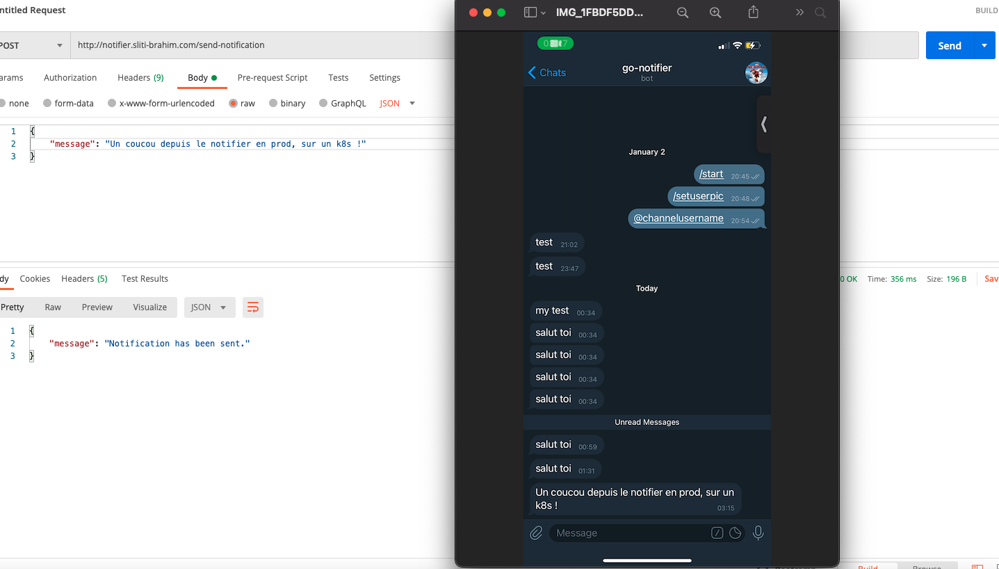

 

  

<h3 align="center">go-telegram-notifier</h3>

# go-telegram-notifier

A Go REST API wrapping the official Telegram API and used to send myself notifications, on my phone, based on some events.

## What is the difference with the official API

- This API is the program running behind the personal bot I created for my use.
- This bot acts as my personnal assistant:
  I want it to push to me notifications on some events and answer me based on actions I ask him to perform (coming later).
- Wanted to handle authentication as I want.
- The application is stored on my own server and I can scale it depending on my needs.

## Overview

Here is an overview of the use of that API (in production).

  

